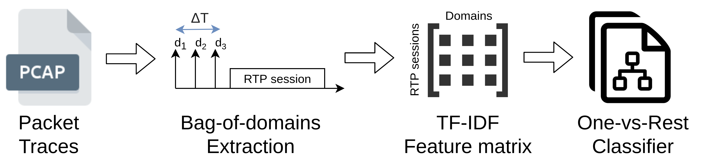

# RTC_apps_classifier
This is an ML classifier to distinguish Online meeting applications used based on TLS data. The methodology is shown on the following figure: 

## Quickstart
main_debug.py is the main, while main_debug_mp.py is the main using multiprocessing.

Before running, open config.py and specify the parameters you want in:
* config_dict_grid --> parameters of TF-IDF and other classification parameters
* output_name --> name of the json file with output
* n_cores --> number of processes to use in case you run main_debug_mp.py

The output will appear in a folder *Output_data/*

## Data
As data it uses the server name specified in TLS Client Hello messages. The data is in the folder *Data_enriched/*. It tries many configurations of parameters and runs classification experiments for all of them.

## Paper
The paper describing this classifier is "What's my App?: ML-based classification of RTC applications" and it's available here: https://dl.acm.org/doi/abs/10.1145/3466826.3466841

#### BibTeX
```
@article{markudova2021s,
  title={What's my app? ml-based classification of rtc applications},
  author={Markudova, Dena and Trevisan, Martino and Garza, Paolo and Meo, Michela and Munafo, Maurizio M and Carofiglio, Giovanna},
  journal={ACM SIGMETRICS Performance Evaluation Review},
  volume={48},
  number={4},
  pages={41--44},
  year={2021},
  publisher={ACM New York, NY, USA}
}
```
